# ⚽ SSB Academy - Sistem Manajemen Sekolah Sepak Bola

<div align="center">


**Tugas UAS Framework Programming**

*Aplikasi Full-Stack untuk Manajemen Sekolah Sepak Bola (SSB) dengan fitur pendaftaran, approval workflow, dan panel admin*

</div>

---

## 📑 Daftar Isi

- [Tentang Project](#-tentang-project)
- [Fitur Utama](#-fitur-utama)
- [Tech Stack](#-tech-stack)
- [Struktur Project](#-struktur-project)
- [Instalasi & Setup](#-instalasi--setup)
- [Cara Penggunaan](#-cara-penggunaan)
- [Penjelasan Kode Penting](#-penjelasan-kode-penting)
- [API Documentation](#-api-documentation)
- [Screenshots](#-screenshots)
- [Author](#-author)

---

## 📖 Tentang Project

**SSB Academy** adalah aplikasi web full-stack untuk manajemen Sekolah Sepak Bola yang mengimplementasikan arsitektur **decoupled** dengan:
- **Backend**: Django REST Framework sebagai API server
- **Frontend**: Vue.js 3 sebagai Single Page Application (SPA)

Aplikasi ini memiliki sistem **approval workflow** dimana pendaftaran pemain harus melalui proses persetujuan admin sebelum dapat mengakses sistem.

### Arsitektur Aplikasi

```
┌─────────────────┐         ┌─────────────────┐         ┌─────────────────┐
│   Vue.js SPA    │ ──────► │   Django REST   │ ──────► │     SQLite      │
│   (Frontend)    │  HTTP   │   (Backend)     │  ORM    │   (Database)    │
│   Port: 5173    │  API    │   Port: 8000    │         │                 │
└─────────────────┘         └─────────────────┘         └─────────────────┘
```

---

## ✨ Fitur Utama

### 👤 User Features
- **Registrasi Pemain** - Form pendaftaran dengan validasi
- **Login/Logout** - Autentikasi berbasis token
- **Profil Pemain** - Lihat dan edit data diri
- **Jadwal Latihan** - Lihat jadwal latihan tim
- **Tim Saya** - Lihat anggota tim dan pelatih

### 👨‍💼 Admin Features
- **Dashboard** - Overview statistik (pemain, pelatih, grup, jadwal)
- **Pending Registrations** - Approve/Reject pendaftaran baru
- **Manajemen Pemain** - CRUD data pemain
- **Manajemen Pelatih** - CRUD data pelatih
- **Manajemen Grup** - CRUD grup latihan
- **Manajemen Jadwal** - CRUD jadwal latihan

### 🔒 Security Features
- Token-based Authentication
- Role-based Access Control (Admin/User)
- Protected API Endpoints
- CORS Configuration

---

## 🛠 Tech Stack

### Backend
| Technology | Description |
|------------|-------------|
| **Python 3.8+** | Programming language |
| **Django 4.x** | Web framework |
| **Django REST Framework** | REST API development |
| **SQLite** | Database (development) |
| **Token Authentication** | API security |

### Frontend
| Technology | Description |
|------------|-------------|
| **Vue.js 3** | JavaScript framework |
| **Vue Router** | Client-side routing |
| **Pinia** | State management |
| **Axios** | HTTP client |
| **Vite** | Build tool |

---

## 📁 Struktur Project

```
FrameworkProgramming-DjangoSSB/
├── 📂 ssb/                          # Backend Django
│   ├── 📂 academy/                  # Main app
│   │   ├── models.py               # Database models
│   │   ├── serializers.py          # API serializers
│   │   ├── views.py                # API views & ViewSets
│   │   ├── urls.py                 # URL routing
│   │   └── signals.py              # Email notifications
│   ├── 📂 ssb/
│   │   ├── settings.py             # Django settings
│   │   └── urls.py                 # Main URL config
│   ├── .env                        # Environment variables
│   └── manage.py
│
├── 📂 frontend-ssb/                 # Frontend Vue.js
│   ├── 📂 src/
│   │   ├── 📂 components/          # Reusable components
│   │   │   ├── AppHeader.vue       # Navigation header
│   │   │   ├── AppFooter.vue       # Footer component
│   │   │   └── UserNavbar.vue      # User navigation
│   │   ├── 📂 views/
│   │   │   ├── 📂 admin/           # Admin pages
│   │   │   └── 📂 user/            # User pages
│   │   ├── 📂 layouts/
│   │   │   └── AdminLayout.vue     # Admin dashboard layout
│   │   ├── 📂 stores/
│   │   │   └── auth.js             # Authentication store (Pinia)
│   │   ├── 📂 services/
│   │   │   └── index.js            # API service layer
│   │   ├── router/index.js         # Vue Router config
│   │   └── main.js                 # App entry point
│   ├── index.html
│   └── vite.config.js
│
├── requirements.txt                 # Python dependencies
└── README.md
```

---

## 🚀 Instalasi & Setup

### Prerequisites returns
- Python 3.8 atau lebih tinggi
- Node.js 16 atau lebih tinggi
- npm atau yarn

### 1️⃣ Clone Repository
```bash
git clone https://github.com/username/FrameworkProgramming-DjangoSSB.git
cd FrameworkProgramming-DjangoSSB
```

### 2️⃣ Setup Backend (Django)

```bash
# Buat virtual environment
python -m venv .venv

# Aktifkan virtual environment
# Windows:
.venv\Scripts\activate
# Linux/Mac:
source .venv/bin/activate

# Install dependencies
pip install -r requirements.txt

# Masuk ke folder backend
cd ssb

# Jalankan migrasi database
python manage.py migrate

# Buat superuser (admin)
python manage.py createsuperuser
# Username: admin
# Password: admin123

# Jalankan server
python manage.py runserver
```

Backend berjalan di: **http://localhost:8000**

### 3️⃣ Setup Frontend (Vue.js)

```bash
# Buka terminal baru, masuk ke folder frontend
cd frontend-ssb

# Install dependencies
npm install

# Jalankan development server
npm run dev
```

Frontend berjalan di: **http://localhost:5173**

---

## 📝 Cara Penggunaan

### Alur Registrasi & Approval

```mermaid
sequenceDiagram
    participant U as User
    participant F as Frontend
    participant B as Backend
    participant A as Admin

    U->>F: Mengisi form registrasi
    F->>B: POST /api/register/
    B->>B: Simpan dengan status "pending"
    B-->>F: Response success
    F-->>U: Notifikasi registrasi sukses
    
    A->>F: Login ke admin panel
    A->>F: Buka Pending Registrations
    F->>B: GET /api/players/pending/
    B-->>F: Daftar pending registrations
    A->>F: Pilih grup & klik Approve
    F->>B: POST /api/players/{id}/approve/
    B->>B: Update status → "approved"
    B-->>F: Response success
    
    U->>F: Login dengan username/password
    F->>B: POST /api/auth/login/
    B-->>F: Token & user data
    U->>F: Akses profile, jadwal, tim
```



### Akses Aplikasi

| Role | URL | Credentials |
|------|-----|-------------|
| **Landing Page** | http://localhost:5173 | - |
| **User Login** | http://localhost:5173/login | (setelah registrasi di-approve) |
| **Admin Login** | http://localhost:5173/admin/login | admin / admin123 |
| **API Docs** | http://localhost:8000/swagger/ | - |

---

## 🔍 Penjelasan Kode Penting

### 1. Model Player dengan Approval Status

```python
# ssb/academy/models.py

class Player(models.Model):
    STATUS_CHOICES = [
        ('pending', 'Pending'),
        ('approved', 'Approved'),
        ('rejected', 'Rejected'),
    ]
    
    user = models.OneToOneField(User, on_delete=models.CASCADE)
    name = models.CharField(max_length=100)
    age = models.IntegerField()
    position = models.CharField(max_length=50)
    group = models.ForeignKey('Group', on_delete=models.SET_NULL, null=True)
    status = models.CharField(max_length=20, choices=STATUS_CHOICES, default='pending')
    registered_at = models.DateTimeField(auto_now_add=True)
```

**Penjelasan:**
- `STATUS_CHOICES` mendefinisikan 3 status: pending, approved, rejected
- `user` menggunakan `OneToOneField` untuk relasi 1:1 dengan User Django
- `on_delete=models.CASCADE` - jika User dihapus, Player ikut terhapus
- `on_delete=models.SET_NULL` - jika Group dihapus, Player tetap ada (group=null)

---

### 2. ViewSet dengan Custom Actions untuk Approve/Reject

```python
# ssb/academy/views.py

class PlayerViewSet(viewsets.ModelViewSet):
    queryset = Player.objects.all()
    serializer_class = PlayerSerializer
    
    @action(detail=False, methods=['get'])
    def pending(self, request):
        """GET /api/players/pending/ - List pending registrations"""
        pending_players = Player.objects.filter(status='pending')
        serializer = self.get_serializer(pending_players, many=True)
        return Response(serializer.data)
    
    @action(detail=True, methods=['post'])
    def approve(self, request, pk=None):
        """POST /api/players/{id}/approve/ - Approve registration"""
        player = self.get_object()
        group_id = request.data.get('group')
        
        player.status = 'approved'
        player.group_id = group_id
        player.save()
        
        return Response({'status': 'approved'})
    
    @action(detail=True, methods=['post'])
    def reject(self, request, pk=None):
        """POST /api/players/{id}/reject/ - Reject registration"""
        player = self.get_object()
        player.status = 'rejected'
        player.save()
        
        return Response({'status': 'rejected'})
```

**Penjelasan:**
- `@action(detail=False)` - endpoint tanpa ID: `/api/players/pending/`
- `@action(detail=True)` - endpoint dengan ID: `/api/players/5/approve/`
- ViewSet otomatis menyediakan CRUD: list, create, retrieve, update, destroy

---

### 3. Token Authentication

```python
# ssb/academy/views.py

from rest_framework.authtoken.models import Token

class LoginView(APIView):
    permission_classes = [AllowAny]
    
    def post(self, request):
        username = request.data.get('username')
        password = request.data.get('password')
        
        user = authenticate(username=username, password=password)
        
        if user:
            # Buat atau ambil token yang sudah ada
            token, created = Token.objects.get_or_create(user=user)
            
            return Response({
                'token': token.key,
                'user_id': user.id,
                'username': user.username,
                'is_staff': user.is_staff  # True = Admin
            })
        
        return Response({'error': 'Invalid credentials'}, status=401)
```

**Penjelasan:**
- `Token.objects.get_or_create(user=user)` - 1 user = 1 token
- Token dikirim di header: `Authorization: Token <token_key>`
- `is_staff` digunakan untuk membedakan admin dan user biasa

---

### 4. Pinia Store untuk State Management

```javascript
// frontend-ssb/src/stores/auth.js

import { defineStore } from 'pinia'
import { authService } from '@/services'

export const useAuthStore = defineStore('auth', {
  state: () => ({
    user: JSON.parse(localStorage.getItem('user')) || null,
    token: localStorage.getItem('token') || null
  }),
  
  getters: {
    isAuthenticated: (state) => !!state.token,
    isAdmin: (state) => state.user?.is_staff === true
  },
  
  actions: {
    async login(username, password) {
      const response = await authService.login(username, password)
      
      this.token = response.token
      this.user = response
      
      // Simpan ke localStorage untuk persistensi
      localStorage.setItem('token', response.token)
      localStorage.setItem('user', JSON.stringify(response))
      
      return response
    },
    
    async logout() {
      await authService.logout()
      
      this.token = null
      this.user = null
      
      localStorage.removeItem('token')
      localStorage.removeItem('user')
    }
  }
})
```

**Penjelasan:**
- `defineStore` membuat reactive store dengan Pinia
- `state` menyimpan data (user, token)
- `getters` seperti computed properties
- `actions` untuk mengubah state (async/sync)
- `localStorage` untuk persistensi data setelah refresh

---

### 5. Vue Router dengan Navigation Guard

```javascript
// frontend-ssb/src/router/index.js

const router = createRouter({
  history: createWebHistory(),
  routes: [
    {
      path: '/admin',
      name: 'admin-dashboard',
      component: () => import('@/views/admin/DashboardView.vue'),
      meta: { requiresAuth: true, requiresAdmin: true }
    },
    {
      path: '/profile',
      name: 'profile',
      component: () => import('@/views/user/ProfileView.vue'),
      meta: { requiresAuth: true }
    }
  ]
})

// Navigation Guard
router.beforeEach(async (to, from, next) => {
  const authStore = useAuthStore()
  
  // Cek apakah route memerlukan autentikasi
  if (to.meta.requiresAuth && !authStore.isAuthenticated) {
    return next({ name: 'login' })
  }
  
  // Cek apakah route memerlukan admin
  if (to.meta.requiresAdmin && !authStore.isAdmin) {
    return next({ name: 'landing' })
  }
  
  next()
})

// Update page title
router.afterEach((to) => {
  document.title = to.path.startsWith('/admin') ? 'SSB Admin' : 'SSB Academy'
})
```

**Penjelasan:**
- `meta` menyimpan metadata route (requiresAuth, requiresAdmin)
- `beforeEach` - guard yang dijalankan sebelum navigasi
- `afterEach` - hook yang dijalankan setelah navigasi
- Lazy loading dengan `() => import(...)` untuk code splitting

---

### 6. Axios Service Layer

```javascript
// frontend-ssb/src/services/index.js

import axios from 'axios'

const api = axios.create({
  baseURL: 'http://localhost:8000/api'
})

// Interceptor untuk menambahkan token otomatis
api.interceptors.request.use((config) => {
  const token = localStorage.getItem('token')
  if (token) {
    config.headers.Authorization = `Token ${token}`
  }
  return config
})

export const playersService = {
  getPlayers: () => api.get('/players/').then(res => res.data),
  getPending: () => api.get('/players/pending/').then(res => res.data),
  approve: (id, groupId) => api.post(`/players/${id}/approve/`, { group: groupId }),
  reject: (id) => api.post(`/players/${id}/reject/`),
  updatePlayer: (id, data) => api.patch(`/players/${id}/`, data),
  deletePlayer: (id) => api.delete(`/players/${id}/`)
}
```

**Penjelasan:**
- `axios.create()` membuat instance dengan baseURL
- `interceptors.request` menambahkan header Authorization otomatis
- Service layer memisahkan HTTP logic dari komponen Vue

---

## 📚 API Documentation

### Endpoints Utama

| Method | Endpoint | Description | Auth Required |
|--------|----------|-------------|---------------|
| POST | `/api/auth/login/` | Login user | ❌ |
| POST | `/api/auth/logout/` | Logout user | ✅ |
| POST | `/api/register/` | Registrasi pemain baru | ❌ |
| GET | `/api/players/` | List semua pemain | ✅ |
| GET | `/api/players/pending/` | List pending registrations | ✅ Admin |
| POST | `/api/players/{id}/approve/` | Approve registrasi | ✅ Admin |
| POST | `/api/players/{id}/reject/` | Reject registrasi | ✅ Admin |
| GET | `/api/coaches/` | List semua pelatih | ✅ |
| GET | `/api/groups/` | List semua grup | ✅ |
| GET | `/api/schedules/` | List semua jadwal | ✅ |

### Interactive Documentation
- **Swagger UI**: http://localhost:8000/swagger/
- **ReDoc**: http://localhost:8000/redoc/

---

## 📸 Screenshots

### Landing Page
- Hero section dengan animasi gradient
- Stats section menampilkan statistik
- Featured coaches dan achievements

### Admin Dashboard
- Sidebar navigation dengan icons
- Stat cards untuk overview
- Quick action buttons

### User Profile
- Avatar dengan inisial nama
- Info grid menampilkan data pemain
- Edit profile modal

---

## 👨‍💻 Author

**Tugas UAS Framework Programming**

| Nama | NIM | Kelas |
|------|-----|-------|
| [Nama Anda] | [NIM Anda] | [Kelas Anda] |

---

## 📄 License

Educational Project - Universitas [Nama Universitas]

---

<div align="center">

Made with ❤️ using **Django REST Framework** + **Vue.js 3**

</div>
